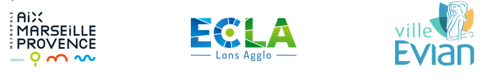
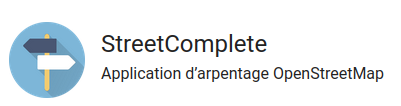

# Crédits

Accèslibre Mobilités est une suite logicielle qui a été imaginée et financée initialement par l'[Agence de l'Innovation pour les Transports](https://www.ecologie.gouv.fr/agence-innovation-transports) et la [Direction 
générale des infrastructures, des transports et des mobilités 
(DGITM)](https://www.ecologie.gouv.fr/direction-generale-des-infrastructures-des-transports-et-des-mobilites-dgitm) 
du Ministère de la Transition écologique et de la Cohésion des territoires, 
avec les cofinancements de France Relance et du programme NextGenerationEU de 
l'Union Européenne.

Accèslibre Mobilités a été initialement développé par le groupement d'entreprises suivantes :

* [Someware](https://www.someware.fr/)
* [Jungle Bus](https://junglebus.io/)
* [Adrien Pavie](https://pavie.info/)
* [Atipy](https://atipy.fr/)

Les premières versions d'Accèslibre Mobilités ont été testées et améliorées grâce aux retours des collectivités pilotes suivantes :

* [la métropole Aix-Marseille-Provence](https://ampmetropole.fr/)
* [l'espace communautaire Lons Agglomération (ECLA)](https://www.ecla-jura.fr/)
* [la ville d'Évian-les-Bains](https://ville-evian.fr/)

L'éditeur web d'Accèslibre Mobilités est une version modifiée d'[iD, l'éditeur web d'OpenStreetMap](https://www.openstreetmap.org/edit?editor=id), le wikipédia des cartes. Le développement d'iD a été rendu possible grâce à environ 300 contributeurs et au support de [Mapbox](https://www.mapbox.com/), la [Knight Foundation](https://knightfoundation.org/), de la [fondation OpenStreetMap](https://osmfoundation.org/) et d'autres.

L'application mobile d'Accèslibre Mobilités est une version modifiée de [StreetComplete](https://streetcomplete.app/), une application de contribution à OpenStreetMap. Le développement de StreetComplete a été rendu possible grâce à environ 120 contributeurs et au support de la fondation [NLnet](https://nlnet.nl/), du [ministère fédéral allemand de l'éducation et de la recherche](https://bmbf.de/), de la [fondation OpenStreetMap](https://osmfoundation.org/) et d'autres.

L'infrastructure technique de gestion et de manipulation des données est basée sur celle du projet [OpenStreetMap](https://www.openstreetmap.org/). Le développement de l'infrastructure du site OpenStreetMap a été rendu possible grâce à environ 200 contributeurs et au support de la [fondation OpenStreetMap](https://osmfoundation.org/) et d'autres. 

Le code source des différents modules d'Accèslibre Mobilités peut être consulté sur [gitlab](https://gitlab.com/yukaimaps).
