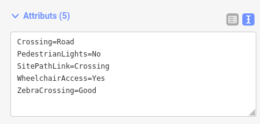

# Modèle de données

Accèslibre Mobilités permet de collecter des données en respectant le standard CNIG Accessibilité et le format d'échange NeTEx accessibilité.

!!! question "CNIG ? "

    Le Conseil national de l'information géographique (CNIG) est une instance consultative qui coordonne et accompagne l'évolution de l'information géolocalisée en France. Son groupe de travail sur l'accessibilité a élaboré un [standard d'échange de données](https://cnig.gouv.fr/ressources-accessibilite-a25335.html) pour définir les objets et les attributs que les collectivités territoriales doivent publier afin de faciliter les déplacements des personnes à mobilité réduite. Le format d'échange de ces données est le [profil NeTEx pour l'accessibilité](https://normes.transport.data.gouv.fr/normes/netex/accessibilit%C3%A9/).

!!! question "NeTEx ?"

    [NeTEx](https://www.netex-cen.eu/) (Network Timetable Exchange) est une norme européenne pour le partage d'informations de transport public sous forme de documents XML. En complément de la norme NeTEx, les [profils France](https://normes.transport.data.gouv.fr/) viennent compléter et expliciter l'interprétation et les attributs retenus pour le partage de données en France.

    Le [profil accessibilité](https://normes.transport.data.gouv.fr/normes/netex/accessibilit%C3%A9/) est le format d'échange qui a été retenu dans le cadre réglementaire en France pour publier des données d'accessibilité à la fois pour la voirie et pour les transports.

Le modèle de données utilisé par AccèsLibre Mobilités (c'est-à-dire les types d'objets qu'il est possible de créer et leurs attributs) a été développé spécialement pour le projet, afin d'être compatible à la fois avec les modèles CNIG et NeTEx.

Rassurez-vous, il n'est pas nécessaire de maitriser le détail de ces modèles de données pour utiliser Accèslibre Mobilités ! L'éditeur web et l'application mobile s'efforceront tant que possible de faire référence à des objets du quotidien comme un trottoir ou une boulangerie.

## Objets

Accèslibre Mobilités permet de représenter les objets suivants :

[point]: ../img/picto-point.png
[ligne]: ../img/picto-ligne.png
[surface]: ../img/picto-surface.png
[node]: ../img/picto-node.png
[way]: ../img/picto-way.png

| Objet             | Géométrie          | Exemples                                                                        |
| ----------------- | ------------------ | ------------------------------------------------------------------------------- |
| `Quay`            | ![point] point  ou ![surface] surface | arrêts de bus, quais de tramway, quais de métro, quais de gare, etc             |
| `StopPlace`       | ![surface] surface | gare, station de métro, station de tramway                                      |
| `PointOfInterest` | ![surface] surface | ERP : commerces, mairie, bibliothèque, etc                                      |
| `Entrance`        | ![point] point     | entrée d'ERP, entrée de gare, bouche de métro                                   |
| `SitePathLink`    | ![ligne] ligne     | trottoir, chemin piéton, passage piéton, rue piétonne, escalier, escalator, etc |
| `ParkingBay`      | ![point] point     | place de stationnement réservée aux usagers de fauteuil roulant                 |
| `Obstacle`        | ![point] point     | ressaut, mobilier urbain génant la circulation, etc                             |
| `Amenity`         | ![point] point     | sanitaires, bancs, abribus, défibrillateur, etc                                 |

## Modélisation

Techniquement, les données sont structurées avec les éléments de base suivants :

* le ![node] nœud (`node`) est un élément ponctuel, défini par une latitude et une longitude. Il permet de représenter les objets sous forme de ![point] point
* le ![way] chemin (`way`) est une suite de ![node] nœuds connectés. Il permet de représenter les objets sous forme de ![ligne] ligne et de ![surface] surface

Des propriétés (aussi appelés "tags") sont assignées à ces éléments de base. Il s'agit d'attributs clef = valeur.

Ainsi un quai de tram sera modélisé techniquement par un ![way] chemin fermé, avec le tag `Quay`=`Tram`. On indiquera son numéro en lui ajoutant un tag `PublicCode`=`2B` par exemple.

Cette modélisation est calquée sur celle du projet [OpenStreetMap](https://www.openstreetmap.org/). Les tags utilisés pour Accèslibre Mobilités sont en revanche différents des tags OpenStreetMap.

!!! example "astuce"

    Dans l'éditeur web, la rubrique "Attributs" du formulaire de modification d'un élément permet de voir les tags d'un objet : 

    

Pour connaitre la liste des tags utilisables pour chacun des types d'objets, se référer à la [documentation du modèle](https://gitlab.com/yukaimaps/yukaidi-tagging-schema/-/blob/main/doc/Walk_data_model.md).
