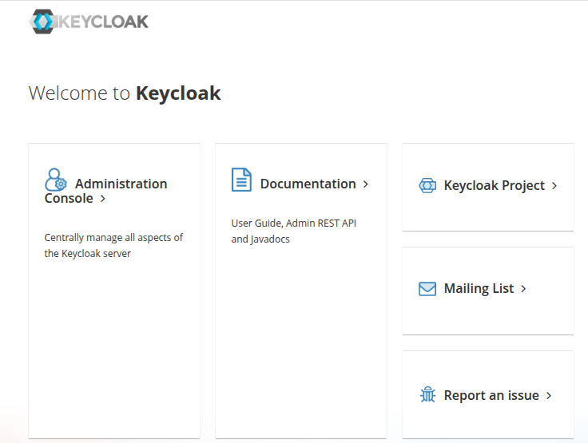
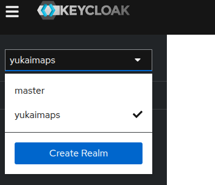
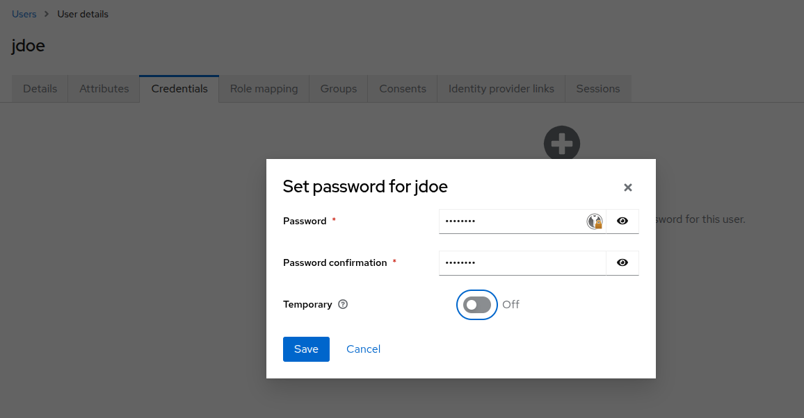
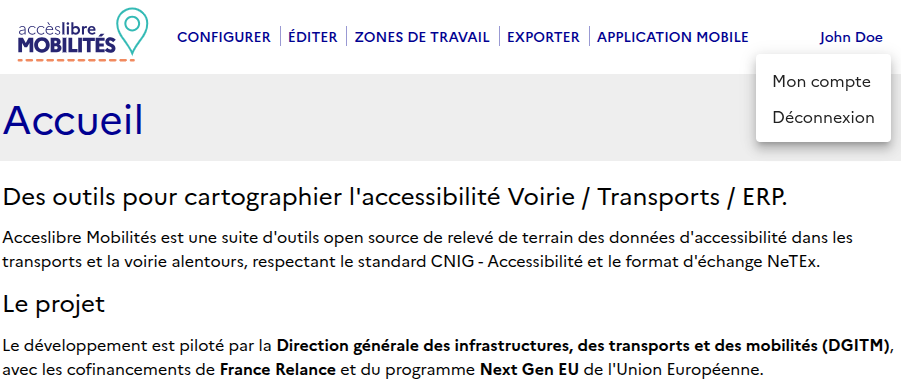

Lorsque le service est déployé avec [docker compose](docker-compose.md),
un serveur d'authentification keycloack est lancé et paramétré.

Il est disponible à l'url `${BASE_URL}/auth/`.

Les identifiants de connexion administrateur sont :

- username : `admin`
- password : mot de passe défini dans la variable d'environnement `${KEYCLOACK_ADMIN_PASSWORD}`

Une fois connecté, on accède à la gestion des gestion des utilisateurs par le lien "Administration Console".

Création d'un utilisateur
-------------------------

Un espace (realm) Yukaimaps a été créé pour l'application. Pour se rendre dans la configuration du
realm, choisir "yukaimaps" dans la liste déroulante en haut à gauche.

Entrer dans la gestion des utilisateurs via le menu de gauche.

Crer un nouvel utilisateur et définir ses identifiants

Il faut ensuite définir un mot de passe pour l'utilisateur via l'onglet "Credentials".
En laissant cochée le champ "Temporary", le mot de passe changé devra être modifié par l'utilisateur
lors de sa première connexion.

Connexion d'un utilisateur
--------------------------

Depuis le portail, cliquer sur "Connexion" en haut à droite. Le formulaire de connexion s'affiche.
L'utilisateur peut s'identifier soit avec son identifiant, soit avec son email.

Si le mot de passe créé par l'administrateur était temporaire, il doit alors définir son nouveau
mot de passe.

L'utilisateur est ensuite redirigé vers le portail.

