# L'éditeur terrain

L'éditeur de terrain, également appelé Fieldwork, est une application web optimisée
pour les smartphones et les tablettes.

Elle permet :

- la saisie d'attributs d'accessibilité
- la prise de photos
- l'ajout d'obstacles
- le découpage de tronçons
- la création de notes

## Présentation générale

L'éditeur de terrain repose sur les principes suivants :

- un fond de plan ou imagerie aérienne est affiché, avec la possibilité de
  centrer la carte sur la position courante.
- les éléments du graphe sont affichés par dessus
- les éléments du graphe sont colorés en fonction de leur complétion
- la sélection d'un élément du graphe ouvre un formulaire permettant la
  saisie des attributs et la prise de photos
- un appui long active les action supplémentaires (création d'obstacle,
  création de note...)

!!! info
    
    Les modifications sont envoyées automatiquement à chaque sauvegarde.
    Cependant en cas de perte de réseau, elles sont conservées et sont envoyées
    soit manuellement, soit automatiquement lors du retour du réseau.

## Connexion au compte Accèslibre Mobilités

L'affichage du graphe et l'envoi des modifications nécessite d'être connecté à son
compte Accèslibre Mobilités. Pour se connecter, ouvrir le menu en haut à gauche et
cliquez sur "Connexion"

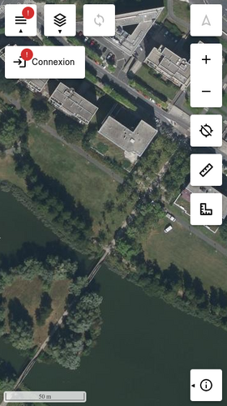
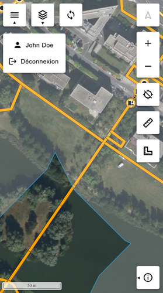

## Saisie d'attributs

Un clic sur un élément du graphe permet sa sélection et l'ouverture d'un menu. Choisir "Saisie"
pour ouvrir le formulaire de saisie.

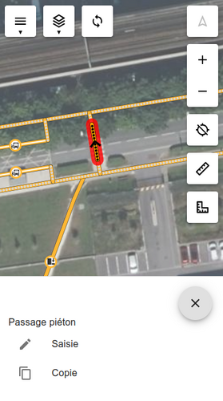
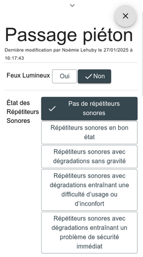

Si besoin de voir la carte lors de la saisie, cliquez sur le chevron en haut du formulaire
permet de le réduire à la moitié de l'écran.

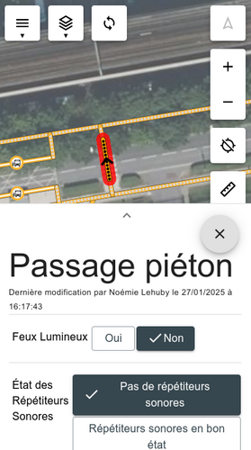

## Sauvegarder les modifications

Lorsqu'un champ est modifié sur le formulaire, deux actions sont possibles :

- sauvegarder les modifications (bouton bleu)
- annuler les modifications (bouton gris)

!!! info

    Si le réseau est défaillant au moment de la sauvegarde, la modification est conservée
    pour être appliquée plus tard. Le nombre de modifications en attente est affiché en haut de
    l'écran. Un clic sur le bouton permet de les synchroniser manuellement.

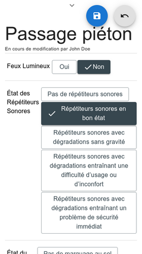
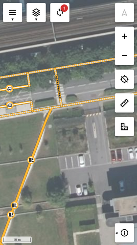

Lorsque tous les champs sont saisis sur un élément du graphe, celui-ci passe en bleu
sur la carte.

## Copie d'attributs

En saisissant "Copie" dans le menu d'édition, il est proposé de sélectionner sur la carte
l'élément dans lequel les attributs doivent être copiés. Il doit s'agit d'un élément semblable
(nœud ou tronçon).

L'élément choisi (en bleu) verra ses attributs vides remplis à partir du premier
élément sélectionné (en rouge) et son formulaire d'édition s'ouvrira pou permettre
de modifier avant sauvegarde.

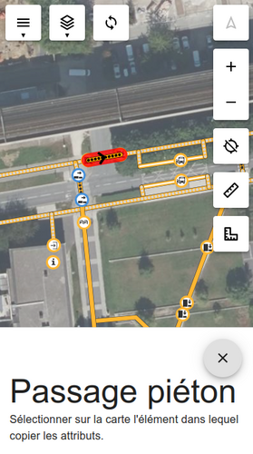
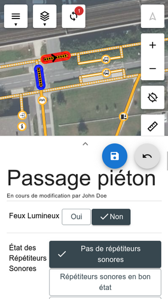

## Création de nœuds

Un appui long sur la carte permet d'ouvrir le menu de création de nœuds. Lorsque celui-ci
est ouvert, un simple clic permet de repositionner le point.

Lorsque le point est situé sur un tronçon, celui-ci est surligné en bleu et le nouveau
nœud sera intégré au tronçon.

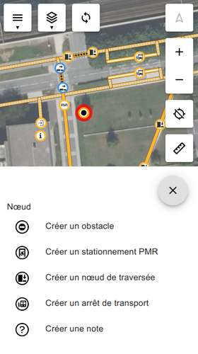
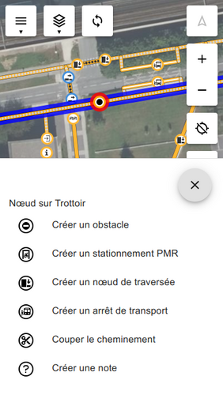

Dans le second cas, une option "Couper le cheminement" est ajouté.

## Répondre aux notes

Les notes sont affichées sur la carte sous la forme de `?`. Un clic sur la note ouvre directement
son formulaire d'édition.

Le formulaire permet de consulter l'historique, d'ajouter un commentaire et une photo,
ainsi que de clôturer la note si nécessaire.

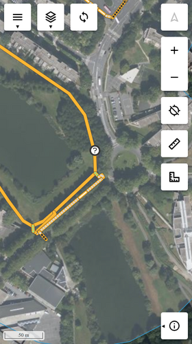
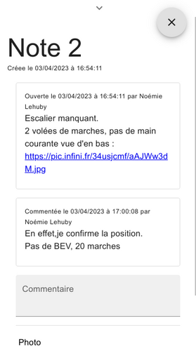

