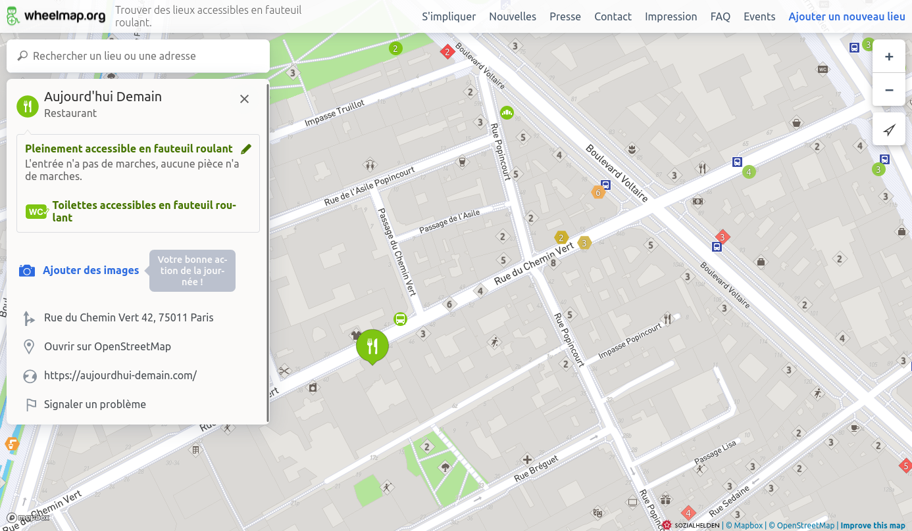

# Import de données d'ERP d'OpenStreetMap

!!! question "OpenStreetMap ?"

    [OpenStreetMap](https://www.openstreetmap.org) (OSM), qu'on présente souvent comme le wikipédia des cartes, est un projet mondial de cartographie collaborative. Sa communauté crée des données librement exploitables. Aujourd’hui considérée comme la base de données cartographique ouverte la plus exhaustive au monde, OpenStreetMap permet notamment la description détaillée des commerces et autres points d'intérêt.

Il est possible d'importer des informations sur les ERP depuis [OpenStreetMap](https://www.openstreetmap.org).

Cette étape est particulièrement pertinente si vous souhaitez vous intéresser à l'accessibilité des commerces, qui peuvent être très nombreux et donc chronophages à renseigner dans Accèslibre Mobilités.

## Prévisualiser les données disponibles

Afin de se faire une idée de la quantité d'ERP déjà renseignées dans OpenStreetMap et d'évaluer la pertinence d'un import, plusieurs outils peuvent être utiles :

* la carte interactive [Wheelmap](https://wheelmap.org/) permet d'inspecter les points d'intérêts et même de compléter s'ils sont accessibles en fauteuil roulant
* la carte interactive [Qwant Maps](https://www.qwant.com/maps/) peut vous permettre d'explorer votre territoire et de cliquer sur les points d'intérêts afin de consulter leurs attributs
* le fond de carte standard d'[OpenStreetMap.org](https://www.openstreetmap.org/) affiche également les commerces et autres points d'intérêts

<figure markdown>

<figcaption>Wheelmap permet de visualiser les commerces et autres lieux d'intérêt, ainsi que quelques attributs en lien avec l'accessibilité en fauteuil roulant. Le site propose également de compléter ces informations grâce à un formulaire très simple.</figcaption>
</figure>

## Détails des données importées

Les objets suivants sont lus et importés depuis OpenStreetMap :

* les commerces
* les services publics (mairie, préfecture, bureau de poste, commissariat, etc)
* les établissements de santé
* les lieux de culte
* les points d'intérêts liés à l'éducation (école, université, etc)
* les points d'intérêts liés à la culture (cinéma, bibliothèque, musée, etc)
* les points d'intérêts liés à la restauration (café, restaurant, etc) et l'hébergement (hôtel)

Les attributs suivants sont pris en compte : le nom, la présence d'éclairage, l'évaluation d'accessibilité pour les fauteils roulants, les informations de contact, la présence de toilettes, la présence de personnel, l'identifiant SIRET, etc

Les entrées d'ERP sont lues et importées, avec les attributs suivants : type d'entrée (porte, barrière, etc), largeur de passage, adresse, type de porte, etc

!!! warning "Points d'attention"

    La représentation des ERP sous forme de surface est préférée afin de positionner les entrées sur le contour de ceux-ci.
    
    Cependant les [relations multipolygones](https://wiki.openstreetmap.org/wiki/FR:Relation:multipolygon) d'OSM (qui permettent de représenter des polygones complexes, en plusieurs morceaux ou avec des trous) ne sont actuellement pas gérées par l'import.

Pour plus d'informations sur les tags et les conversions réalisés, se reporter à la [documentation du module d'import](https://gitlab.com/yukaimaps/yukaimaps-osm2wdm/-/blob/main/doc/osm2wdm.md).

## Focus sur la licence

Les données OpenStreetMap sont publiées sous la [licence ODbL](https://www.openstreetmap.org/copyright) par la fondation OpenStreetMap, auxquelles s'ajoutent des [Directives générales](https://osmfoundation.org/wiki/Licence/Community_Guidelines) ("community guidelines").
Ainsi, les données OpenStreetMap sont open data et librement utilisables pour être importées et servir de base au graphe piéton d'Accèslibre Mobilités.

L'utilisation de l'import OpenStreetMap dans Accèslibre Mobilités impose cependant les conditions suivantes :

* l'attribution : les données finales que vous publierez après utilisation d'Accèslibre Mobilités doivent préciser qu'OpenStreetMap a été utilisé. Voici à titre indicatif une proposition de formulation d'attribution : [Nom de ma collectivité] - contient des données OpenStreetMap
* le partage à l'identique : les données finales que vous publierez après utilisation d'Accèslibre Mobilités doivent être sous licence ODbL

Plus d'information sur la page dédiée aux [licences](../../publish/licence.md)

[point]: ../../../img/picto-point.png
[ligne]: ../../../img/picto-ligne.png
[surface]: ../../../img/picto-surface.png
