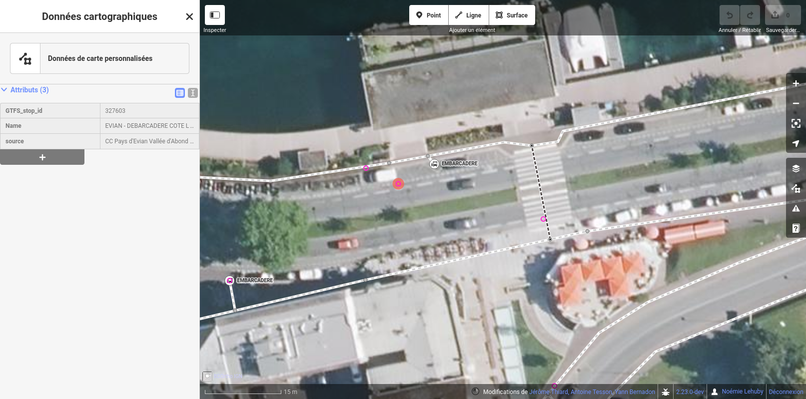

# Import de données d'ERP

[point]: ../../../img/picto-point.png
[ligne]: ../../../img/picto-ligne.png
[surface]: ../../../img/picto-surface.png

L'import des arrêts de points d'intérêts permet d'initialiser la base de données d'AccesLibre Mobilités avec des ERP (établissement recevant du public).

Les objets suivants peuvent ainsi être créés à partir d'un import :

| Objet           | Géométrie                                   | Exemples                                   |
| --------------- | ------------------------------------------- | ------------------------------------------ |
| PointOfInterest | ![surface] surface  ![point] point sinon | ERP : commerces, mairie, bibliothèque, etc |
| Entrance        | ![point] point                              | entrée d'ERP                               |

## Sources et formats supportés

Les sources suivantes sont supportées :

- [données AccesLibre](imports-erp-acceslibre.md) : il s'agit ici d'utiliser les données publiées sur le portail AccesLibre
- [données OpenStreetMap](imports-erp-osm.md) : il s'agit ici d'utiliser les données du projet OpenStreetMap, le wikipédia des cartes

## Autres

Si vous disposez d'un jeu de données en interne d'une source ou d'un format non décrits ci-dessus, voici quelques options :

### L'affichage du jeu de données dans l'éditeur web

L'éditeur web permet d'afficher des couches de données externes en superposition du graphe. Cette option peut être pertinente par exemple si vous disposez des commerces ou des ERP gérés par la commune (mairie, bibliothèques, écoles, etc) et qu'ils sont peu nombreux / qu'ils n'ont pas ou peu d'attributs que l'on souhaite récupérer dans AccesLibre Mobilités.
Dans ce cas, il est possible d'afficher ce jeu de données et de "recopier" les informations qui nous intéressent.

<figure markdown>
  
  <figcaption>Ici, un jeu de données contenant des points a été ajouté à l'éditeur web sous la forme d'une couche de "données de carte personnalisées" (affiché en rose). On peut alors visualiser la position de chaque point et consulter ses attributs en cliquant dessus.</figcaption>
</figure>

Vous pouvez réaliser cette étape en toute autonomie : [voir le mode opératoire](../../web/astuces.md/#afficher-des-donnees-tierces).

### L'intégration du jeu de données à OpenStreetMap

Si vous en avez les compétences, vous pouvez éditer OpenStreetMap et ajouter les commerces et points d'intérêts dans OpenStreetMap, puis réaliser un [import OpenStreetMap](imports-erp-osm.md) en autonomie.

<figure markdown>
  
  <figcaption>Il existe déjà des outils pour compléter OpenStreetMap en utilisant les données de commerces disponibles en open data, à l'instar de l'éditeur BANCO.</figcaption>
</figure>

Notre équipe peut également vous [proposer un accompagnement](../../../contact.md) pour contribuer à OpenStreetMap.

### La réalisation d'un nouveau module d'import de données d'ERP

Si vos données sont standardisées ou normalisées ou issues d'un logiciel fréquemment utilisés par les utilisateurs d'AccesLibre Mobilités, il peut être pertinent de créer un nouveau module d'import afin de pouvoir gérer durablement ce format de données.

Notre équipe peut vous [proposer un accompagnement](../../../contact.md) pour créer ce nouveau module d'import.
