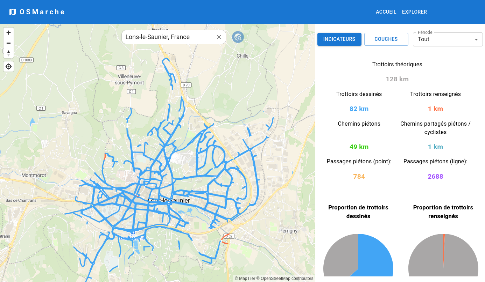
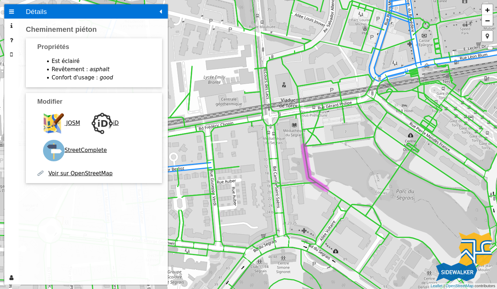
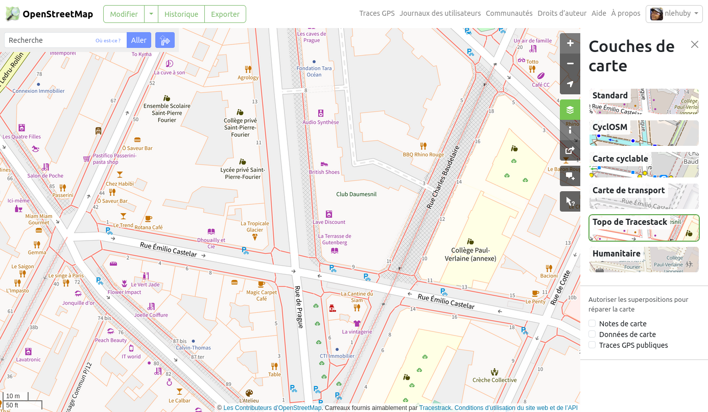

# Import de données de cheminement d'OpenStreetMap

!!! question "OpenStreetMap ?"

    [OpenStreetMap](https://www.openstreetmap.org) (OSM), qu'on présente souvent comme le wikipédia des cartes, est un projet mondial de cartographie collaborative. Sa communauté crée des données librement exploitables. Aujourd’hui considérée comme la base de données cartographique ouverte la plus exhaustive au monde, OpenStreetMap permet notamment la description détaillée de la voirie et des cheminements piétons.

Il est possible d'importer des données de cheminement piéton d'[OpenStreetMap](https://www.openstreetmap.org) pour initialiser le graphe piéton AccesLibre Mobilités avec les trottoirs et passages piétons déjà renseignées dans OpenStreetMap.

L'étape d'import peut faire gagner un temps significatif de saisie, car [la création du graphe piéton](../../web/graphe.md) est une étape très chronophage et qui a une importance cruciale pour la poursuite du projet. De plus, elle permet de tirer partie des éventuels informations déjà renseignées par les contributeurs OpenStreetMap telles que la nature du revêtement, sa qualité ou encore la présence de marquage des traversées piétonnes.

## Prévisualiser les données disponibles

Afin de connaitre la quantité de trottoir et de traversées déjà renseignées dans OpenStreetMap et d'évaluer la pertinence d'un import, plusieurs outils peuvent être utiles :

* [OSMarche](https://osmarche.someware.fr/)
* [Jungle Bus Sidewalker](https://jungle-bus.github.io/sidewalker/)
* certains fonds de carte détaillés basés sur OpenStreetMap

=== "OSMarche"

    L'outil [OSMarche](https://osmarche.someware.fr/) permet de visualiser les trottoirs et cheminements piétons d'OpenStreetMap pour une commune donnée.

    <figure markdown>
      
      <figcaption>OSMarche permet de visualiser les différents types de cheminement piéton présents dans OpenStreetMap et fournit des indicateurs chiffrés et illustrés sur les méthodes de cartographie utilisées localement et sur la quantité théorique attendue de km de trottoirs.</figcaption>
    </figure>

=== "Jungle Bus Sidewalker"

    L'outil [Jungle Bus Sidewalker](https://jungle-bus.github.io/sidewalker/) permet de visualiser les trottoirs et cheminements piétons d'OpenStreetMap dans une zone donnée. 

    <figure markdown>
      
      <figcaption>Jungle Bus Sidewalker permet de visualiser les différents types de cheminement piéton présents dans OpenStreetMap. En cliquant sur un élément, on peut vérifier ses attributs. 
      
      L'outil propose également quelques fonctionnalités de contrôle qualité et d'édition, ainsi qu'un QR Code pour télécharger un ensemble de quêtes thématiques aux trottoirs et traversées pour l'application [StreetComplete](https://streetcomplete.app/), afin de permettre à des contributeurs débutants de compléter ces attributs simplement.</figcaption>
    </figure>

=== "Fonds de carte OSM"

    Les cheminements piétons sont affichés en pointillé (en général rouge) sur le fond de carte standard d'[OpenStreetMap.org](https://www.openstreetmap.org/).

    D'autres fonds de carte, également basés sur les données OpenStreetMap, permettent de visualiser ces cheminements à fort niveau de zoom :

    * le fond Topo de Tracestack, disponible sur [openstreetmap.org](https://www.openstreetmap.org/#map=18/48.84941/2.37573&layers=P) (les trottoirs sont affichés en rouge)
    * le [fond de l'association OpenStreetMap France](https://tile.openstreetmap.fr/?zoom=20&lat=44.13504&lon=4.81066&layers=B00000000FFFFFF), qui affiche également les places de parking réservées UFR

    

Il est fortement recommandé de réaliser une mise en qualité des données OpenStreetMap avant de réaliser l'import, afin de simplifier le travail de création de graphe. [Notre équipe peut vous accompagner](../../../contact.md) sur ce sujet.

## Détails des données importées

### Cheminements piétons

L'essentiel des cheminements piétons tels que décrits sur la page de wiki OSM [FR:Cheminements piétons](https://wiki.openstreetmap.org/wiki/FR:Cheminements_pi%C3%A9tons) est importé :

* les chemins piétons
* les passages piétons
* les trottoirs cartographiés en chemin
* les escaliers, rampes, ascenseurs, etc

!!! warning "Points d'attention"

    Les trottoirs cartographiés sur la voirie (avec le tag sidewalk sur des objets représentant les routes) sont ignorés et ne sont pas importés. Il existe cependant un paramètre expérimental pour importer les routes qui disposent de ce tag sidewalk (mais il s'agit alors d'une ligne au centre de la voie et non de trottoirs parallèles à la voirie).
    
    Les passages piétons représentés uniquement sous forme de ![point] point sont transformés en ![ligne] ligne à l'import, il faudra alors créer et les rattacher aux trottoirs attenants.
    
    Les places piétonnes et les trottoirs surfaciques sont importés tels quels. Il peut être nécessaire de créer en complément des cheminements piétons pour permettre de les traverser sans en faire le tour complet...

La plupart des tags décrits sur la page de wiki [FR:Cheminements piétons](https://wiki.openstreetmap.org/wiki/FR:Cheminements_pi%C3%A9tons) est gérée.

### Équipements et autres objets

En complément des cheminements piétons, les objets suivants sont également lus et importés :

* les places de stationnement réservés aux personnes à mobilité réduite
* certains obstacles : les barrières, les marches, les poteaux, les arbres, etc
* certains équipements : les sanitaires, les abris voyageur, les guichets, les boites aux lettres, etc
* les équipements qu'on retrouve fréquemment en gare : téléphone d'urgence, défibrillateurs, validateurs de tickets, automate de vente de tickets, etc

Tous sont importés sous forme de ![point] points, quelque soit leur géométrie initiale dans OpenStreetMap.

Un cheminement artificiel est également automatiquement créé entre les places de stationnement / les arrêts / les entrées et le reste des cheminements importés, afin qu'ils soient connectés au graphe piéton.

### Liens utiles

* [page de wiki OSM sur les cheminements piétons](https://wiki.openstreetmap.org/wiki/FR:Cheminements_pi%C3%A9tons)
* [documentation du module d'import](https://gitlab.com/yukaimaps/yukaimaps-osm2wdm/-/blob/main/doc/osm2wdm.md)

## Focus sur la licence

Les données OpenStreetMap sont publiées sous la [licence ODbL](https://www.openstreetmap.org/copyright) par la fondation OpenStreetMap, auxquelles s'ajoutent des [Directives générales](https://osmfoundation.org/wiki/Licence/Community_Guidelines) ("community guidelines").
Ainsi, les données OpenStreetMap sont open data et librement utilisables pour être importées et servir de base au graphe piéton d'AccesLibre Mobilités.

L'utilisation de l'import OpenStreetMap dans AccesLibre Mobilités impose cependant les conditions suivantes :

* l'attribution : les données finales que vous publierez après utilisation d'AccesLibre Mobilités doivent préciser qu'OpenStreetMap a été utilisé. Voici à titre indicatif une proposition de formulation d'attribution : [Nom de ma collectivité] - contient des données OpenStreetMap
* le partage à l'identique : les données finales que vous publierez après utilisation d'AccesLibre Mobilités doivent être sous licence ODbL

Plus d'information sur la page dédiée aux [licences](../../publish/licence.md)

[point]: ../../../img/picto-point.png
[ligne]: ../../../img/picto-ligne.png
