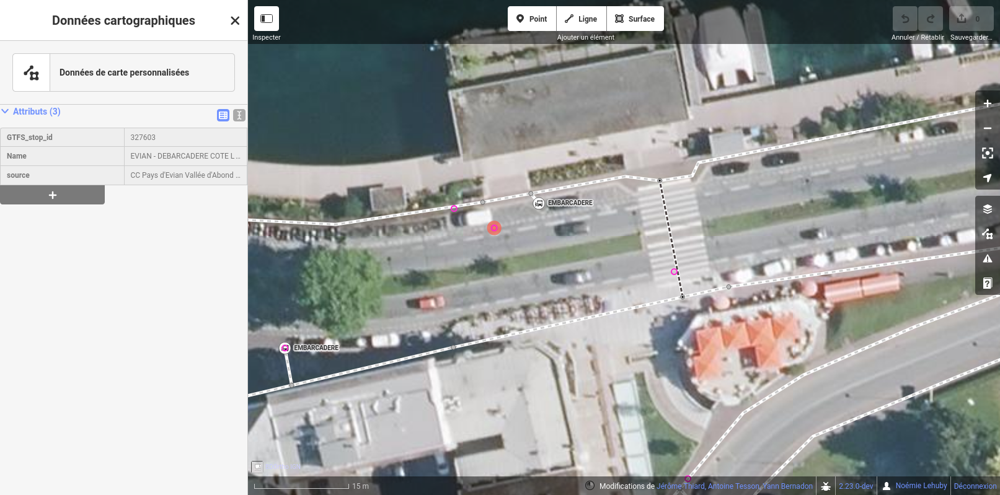
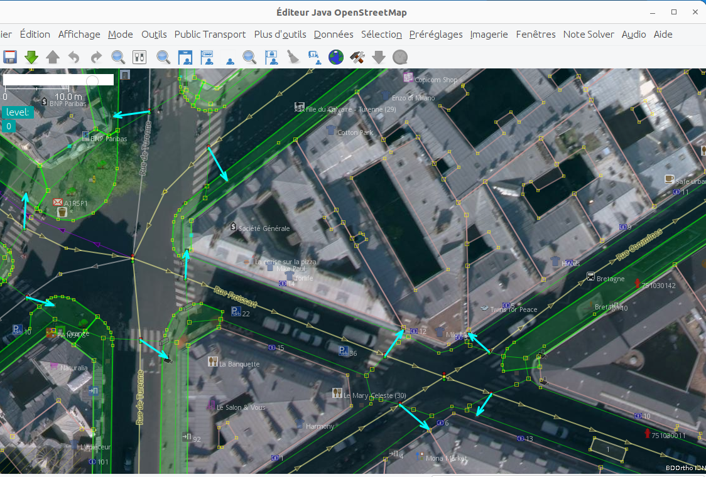

# Import de données de cheminement

[point]: ../../../img/picto-point.png
[ligne]: ../../../img/picto-ligne.png
[surface]: ../../../img/picto-surface.png

L'import des cheminements piétons permet d'initialiser le graphe piéton, c'est-à-dire le réseau des trottoirs et passages piétons qui constitue la base de la collecte d'information dans AccesLibre Mobilités.

!!! abstract "Conseil"

    Créer un "bon" graphe piéton est un pré-requis indispensable à la réussite de votre projet de création de données d'accessibilité. Mais le dessin d'un graphe piéton complet est aussi une opération très chronophage : il est donc vivement conseillé d'avoir recours à un import dès que des données sont pré-existantes.

À noter que les équipements, obstacles et places de stationnement réservées UFR sont également importés lors de l'import des cheminements.

Les objets suivants peuvent ainsi être créés à partir d'un import de cheminement :

| Objet        | Géométrie      | Exemples                                                                        |
| ------------ | -------------- | ------------------------------------------------------------------------------- |
| SitePathLink | ![ligne] ligne | trottoir, chemin piéton, passage piéton, rue piétonne, escalier, escalator, etc |
| ParkingBay   | ![point] point | place de stationnement réservée aux usagers de fauteuil roulant                 |
| Obstacle     | ![point] point | ressaut, mobilier urbain génant la circulation, etc                             |
| Amenity      | ![point] point | sanitaires, bancs, abribus, défibrillateur, etc                                 |

## Sources et formats supportés

Les sources suivantes sont supportées :

- [données OpenStreetMap](imports-cheminement-osm.md) : il s'agit ici d'utiliser les données du projet OpenStreetMap, le wikipédia des cartes

## Autres

Si vous disposez d'un jeu de données en interne d'une source ou d'un format non décrits ci-dessus, voici quelques options :

### L'affichage du jeu de données dans l'éditeur web

L'éditeur web permet d'afficher des couches de données externes en superposition du graphe. Cette option peut être pertinente par exemple si vous disposez d'une liste de mobilier urbain avec leur position et qu'il n'est pas pertinent de tout importer (seuls ceux qui constituent des obstacles vont être intéressants).
Dans ce cas, il est possible d'afficher ce jeu de données et de "recopier" les informations qui nous intéressent.

<figure markdown>
  
  <figcaption>Ici, un jeu de données contenant des points a été ajouté à l'éditeur web sous la forme d'une couche de "données de carte personnalisées" (affiché en rose). On peut alors visualiser la position de chaque point et consulter ses attributs en cliquant dessus.</figcaption>
</figure>

Vous pouvez réaliser cette étape en toute autonomie : [voir le mode opératoire](../../web/astuces.md/#afficher-des-donnees-tierces).

### L'intégration du jeu de données à OpenStreetMap

Si vous disposez par exemple d'un jeu de données avec la liste des places de stationnement PMR ou des relevés des BEV de votre territoire, ces données peuvent venir enrichir le graphe d'AccesLibre Mobilités : si vous en avez les compétences, vous pouvez éditer OpenStreetMap et ajouter ces informations dans OpenStreetMap, puis réaliser un [import OpenStreetMap](imports-cheminement-osm.md) en autonomie.

<figure markdown>
  
  <figcaption>Les outils d'éditions avancés d'OpenStreetMap permettent de comparer un jeu de données tiers avec OpenStreetMap et de l'utiliser pour améliorer OpenStreetMap, par exemple comme ici, pour compléter les attributs des passages piétons.</figcaption>
</figure>

Notre équipe peut également vous [proposer un accompagnement](../../../contact.md) pour contribuer à OpenStreetMap.

### La réalisation d'un nouveau module d'import de données de cheminement

Si vos données sont standardisées ou normalisées ou issues d'un logiciel fréquemment utilisés par les utilisateurs d'AccesLibre Mobilités, il peut être pertinent de créer un nouveau module d'import afin de pouvoir gérer durablement ce format de données.

Notre équipe peut vous [proposer un accompagnement](../../../contact.md) pour créer ce nouveau module d'import.
