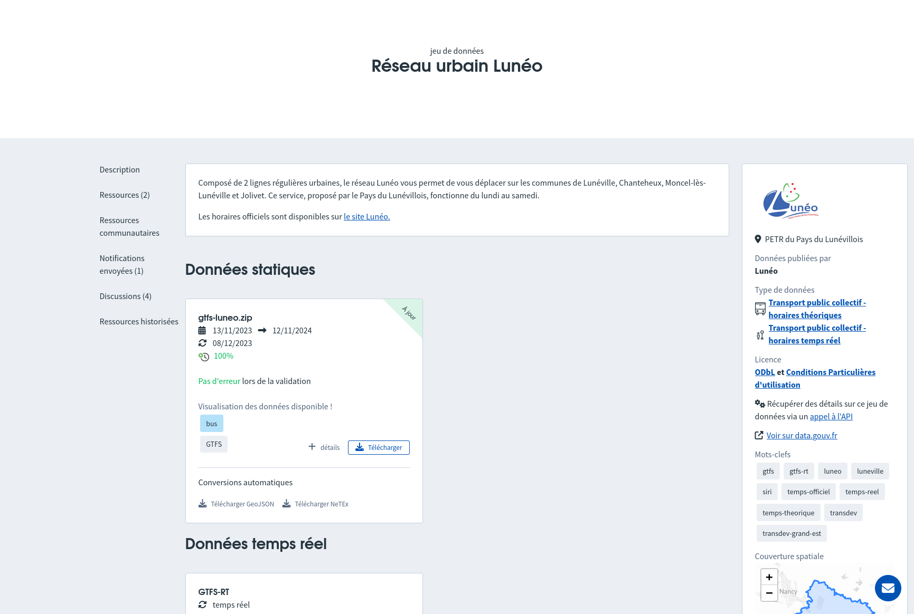

# Import de données transport au format NeTEx

!!! question "NeTEx ?"

    [NeTEx](https://transmodel-cen.eu/index.php/netex/) (Network Timetable Exchange) est une norme européenne pour le partage d'informations de transport public sous forme de documents XML. C'est le format d'échange qui a été retenu dans le cadre réglementaire en France pour publier des données de transport en commun et d'accessibilité.

    En complément de la norme NeTEx, les [profils France](https://normes.transport.data.gouv.fr/) viennent compléter et expliciter l'interprétation et les attributs retenus pour le partage de données en France.

Il est possible d'importer des données transport au format NeTEx pour initialiser Accèslibre Mobilités avec les arrêts de transport et les gares déjà renseignées en open data. Cela vous permet notamment d'utiliser les mêmes identifiants et donc de faciliter l'interopérabilité.

## Trouver un jeu de données NeTEx

Le [Point d'accès national (PAN)](https://transport.data.gouv.fr/) référence l'ensemble des données de mobilité publiées en open data en France. C'est donc l'endroit idéal pour télécharger les données transport disponibles sur votre territoire, mises à disposition par les transporteurs, leurs prestataires en charge de l'information voyageur ou directement par les collectivités organisatrices de mobilité.

Le PAN dispose d'un moteur de recherche qui vous permet de rechercher votre territoire ou le nom de votre réseau et trouver les données publiées. Celles qui nous intéressent portent sur le "Transport public collectif - horaires théoriques", et sont au format NeTEx.
S'il existe uniquement un jeu de données au format GTFS, les conversions automatiques proposées par le point d'accès national vous permettront de télécharger un fichier valide au format NeTEx correspondant.

<figure markdown>
  
  <figcaption>Sur le PAN, sur la page d'un jeu de données, la colonne de droite vous permet de vérifier le type de données, la licence et la couverture géographique.
  Le lien "détails" vous permet d'obtenir quelques informations sur le nombre d'arrêts, sur la présence d'information d'accessibilité et de visualiser leur position sur une carte.
  Enfin, le lien Télécharger NeTEx vous permet d'obtenir le fichier à utiliser pour l'import Accèslibre Mobilités.
</figcaption>
</figure>

TODO [à compléter si nécessaire avec des captures du portail pour décrire plus précisément comment utiliser ce fichier dans le portail (est-ce qu'il faut juste envoyer le fichier arrêts / tout le zip, comment en envoyer plusieurs, etc)]

## Détail des données importées

Le module d'import NeTEx gère les données conformes au [profil FR arrêt](https://normes.transport.data.gouv.fr/normes/netex/arrets/).

Les objets `Quay` (arrêts et les quais de transport) sont lus et importés, avec les attributs suivants : le nom, l'éventuel code public, la présence d'éclairage, l'évaluation d'accessibilité pour les fauteils roulants, la présence d'information voyageur, la présence d'information voyageur sonore, etc.

Les objets `StopPlace` (gares, stations, gares routières) sont lus et importés, avec les attributs suivants : le nom, la présence d'annonces sonores, la présence d'information voyageur, etc

Les objets `Entrance` ou `StopPlaceEntrance` (entrées de gares et bouches de métro) sont lues et importées, avec les attributs suivants : éventuel nom et numéro, type d'entrée (porte, barrière, etc), largeur de passage, adresse, etc

!!! warning "Points d'attention"

    Seuls les objets ayant une position géographique peuvent être importés dans Accèslibre Mobilités. Les `Quay` ou `StopPlace` sans coordonnées sont donc ignorés.

    Les `StopPlace` sont uniquement importés s'ils comportent au moins un `Quay` ou un `StopPlaceEntrance`. Cela signifie qu'en général les zones d'arrêts multimodales servant uniquement d'enveloppe à des zones d'arrêts monomodales sont ignorées.

    Conformément au [profil arrêt](https://normes.transport.data.gouv.fr/normes/netex/arrets/), le mode de transport est obligatoire pour les `Quay` et les `StopPlace`. Sans cette information, les objets NeTEx sont donc ignorés.

## Focus sur la licence

Chaque jeu de données peut être publié sous une licence qui lui est propre, et qui impose un certain nombre de conditions d'utilisations. Il vous incombe de vérifier qu'elles sont bien en accord avec vos cas d'usages.

À titre indicatif, voici les licences les plus fréquemment utilisées pour publier des données transport sur le Point d'Accès National (PAN).

=== "Licence ouverte"

    Les données NeTEx publiées sous [licence ouverte](https://www.etalab.gouv.fr/licence-ouverte-open-licence/) sont open data et librement utilisables pour être importées et servir de base au graphe piéton d'Accèslibre Mobilités.

    L'utilisation d'un import en licence ouverte dans Accèslibre Mobilités impose notamment les conditions suivantes :

    * l'attribution : les données finales que vous publierez après utilisation d'Accèslibre Mobilités doivent préciser que des données sous licence ouverte ont été utilisées ainsi que la date de dernière mise à jour des données utilisées. Voici à titre indicatif une proposition de formulation d'attribution : [Nom de ma collectivité] - contient des données de [producteur licence ouverte] (mise à jour de février 2023)

=== "Licence ODbL"

    Certaines données sont publiées sous licence [ODbL](https://opendatacommons.org/licenses/odbl/1.0/). En général, les [conditions particulières](https://doc.transport.data.gouv.fr/le-point-d-acces-national/cadre-juridique/conditions-dutilisation-des-donnees/licence-odbl) du PAN s'appliquent également.

    Ces données sont open data et librement utilisables pour être importées et servir de base au graphe piéton d'Accèslibre Mobilités.

    L'utilisation d'un import en licence ODbL dans Accèslibre Mobilités impose notamment les conditions suivantes :

    * l'attribution : les données finales que vous publierez après utilisation d'Accèslibre Mobilités doivent préciser que des données sous licence ouverte ont été utilisées. Voici à titre indicatif une proposition de formulation d'attribution : [Nom de ma collectivité] - contient des données de [producteur licence ODbL]
    * le partage à l'identique : les données finales que vous publierez après utilisation d'Accèslibre Mobilités doivent être sous licence ODbL

=== "Licence Mobilités"

    Certaines données sont publiées sous [licence "Mobilités"](https://wiki.lafabriquedesmobilites.fr/wiki/Licence_Mobilit%C3%A9s).

    Ces données ne sont pas librement réutilisables et nécessitent un accord du producteur de données avant tout import.

    De plus, des conditions similaires à la licence ODbL s'appliqueront aux données finales que vous publierez après utilisation d'Accèslibre Mobilités.

Plus d'information sur la page dédiée aux [licences](../../publish/licence.md)

