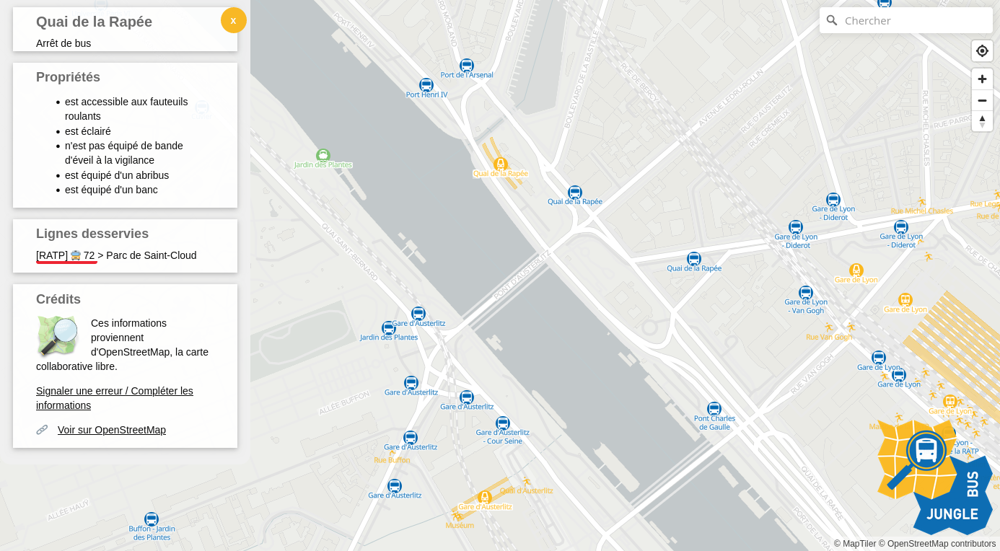

# Import de données transport d'OpenStreetMap

!!! question "OpenStreetMap ?"

    [OpenStreetMap](https://www.openstreetmap.org) (OSM), qu'on présente souvent comme le wikipédia des cartes, est un projet mondial de cartographie collaborative. Sa communauté crée des données librement exploitables. Aujourd’hui considérée comme la base de données cartographique ouverte la plus exhaustive au monde, OpenStreetMap permet notamment la description détaillée des arrêts et réseaux de transport.

Il est possible d'importer des données transport d'[OpenStreetMap](https://www.openstreetmap.org) pour initialiser Accèslibre Mobilités avec les arrêts de transport et les gares déjà renseignées dans OpenStreetMap.

## Prévisualiser les données disponibles

L'outil [Jungle Bus Map](https://jungle-bus.github.io/map) permet de prévisualiser les données de transport présentes dans OpenStreetMap, de se faire une idée de leur quantité et de leur qualité et d'estimer l'intérêt de réaliser un import.

<figure markdown>
  
  <figcaption>Jungle Bus Map permet de visualiser les arrêts, les quais, les entrées de métro et les stations, ainsi que quelques uns de leurs attributs dans OpenStreetMap.</figcaption>
</figure>

Si vous avez les compétences nécessaires, il peut également être pertinent de réaliser une mise en qualité des données OpenStreetMap avant de réaliser l'import, afin de simplifier le travail de création de graphe. 
 Notre équipe peut vous [accompagner](../../../contact.md) sur ce sujet.

## Détails des données importées

Les arrêts et les quais de transport sont lus et importés, avec les attributs suivants : le nom, l'éventuel numéro de quai, la présence d'une bande d'éveil à la vigilance ou d'un revêtement rugueux en bordure de quai, la présence d'éclairage, l'évaluation d'accessibilité pour les fauteils roulants, la présence d'information voyageur, la présence d'information voyageur sonore, les équipements de l'arrêts (abri, banc, poubelle, etc), etc.

Les gares, stations, aéroports, gares routières sont lus et importés, avec les attributs suivants : le nom, la présence d'annonces sonores, la présence d'information voyageur, etc

Remarque : il est également possible d'importer les équipements spécifiques aux gares tels que les téléphones d'urgence, le mobilier de signalétique, les équipements de billetique, etc. Il faut pour cela réaliser un [import des cheminements d'OpenStreetMap](../cheminement/imports-cheminement-osm.md).

Les entrées de gares et bouches de métro sont lues et importées, avec les attributs suivants : éventuel nom et numéro, type d'entrée (porte, barrière, etc), largeur de passage, adresse, type de porte, etc

!!! warning "Points d'attention"

    Le mode de transport est une notion prépondérante (obligatoire dans le modèle), mais qui n'est pas toujours facilement déductible des données OSM.
    
    On s'assurera donc que les arrêts font bien partie d'une ligne de transport indiquant un mode de transport (une [relation type=route et route=[mode de transport]](https://wiki.openstreetmap.org/wiki/FR:Bus#Ligne_de_bus) ou qu'un autre tag permet de déduire ce mode). 
    
    De même, l'utilisation du tag [station](https://wiki.openstreetmap.org/wiki/Key:station) est recommandée pour différencer les gares des stations.

    Dans le cas de quai modélisé avec une [relation multipolygone](https://wiki.openstreetmap.org/wiki/FR:Relation:multipolygon), seul le contour extérieur est importé.

    En cas de doute, n'hésitez pas à vous [faire accompagner](../../../contact.md) avant de réaliser l'import OpenStreetMap.

Pour plus d'informations sur les tags et les conversions réalisés, se reporter à la [documentation du module d'import](https://gitlab.com/yukaimaps/yukaimaps-osm2wdm/-/blob/main/doc/osm2wdm.md).

## Focus sur la licence

Les données OpenStreetMap sont publiées sous la [licence ODbL](https://www.openstreetmap.org/copyright) par la fondation OpenStreetMap, auxquelles s'ajoutent des [Directives générales](https://osmfoundation.org/wiki/Licence/Community_Guidelines) ("community guidelines").
Ainsi, les données OpenStreetMap sont open data et librement utilisables pour être importées et servir de base au graphe piéton d'Accèslibre Mobilités.

L'utilisation de l'import OpenStreetMap dans Accèslibre Mobilités impose cependant les conditions suivantes :

* l'attribution : les données finales que vous publierez après utilisation d'Accèslibre Mobilités doivent préciser qu'OpenStreetMap a été utilisé. Voici à titre indicatif une proposition de formulation d'attribution : [Nom de ma collectivité] - contient des données OpenStreetMap
* le partage à l'identique : les données finales que vous publierez après utilisation d'Accèslibre Mobilités doivent être sous licence ODbL

Plus d'information sur la page dédiée aux [licences](../../publish/licence.md)
