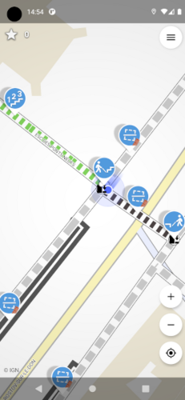
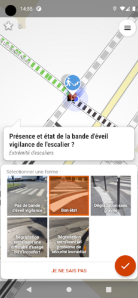
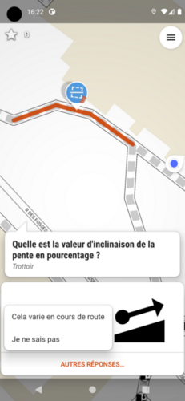
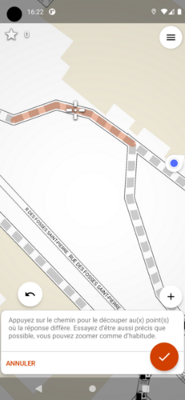
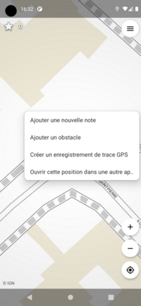
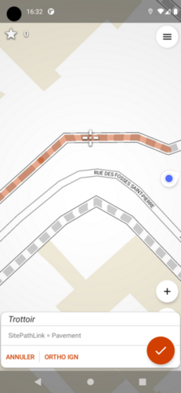
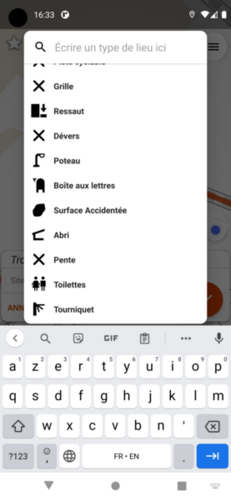

# L'application mobile

L'application mobile permet à partir d'un smartphone ou d'une tablette Android 
de relever sur le terrain les attributs d'accessibilité du graphe.

## Utilisation

L'utilisation de l'application repose sur les principes suivants :

* un fond de plan ou imagerie aérienne est affiché, centré sur la position 
  courante.
* les éléments du graphe sont affichés par dessus
* sur les éléments pour lesquels il manque des attributs, des pictogrammes sont 
  affichés invitant l'utilisateur à répondre à une question (aussi appelées 
  *quête*.
* en répondant aux *quêtes*, on compléte les attributs d'accessibilité du 
  graphe.

!!! info
    
    Par défaut, les réponses aux quêtes sont envoyées automatiquement si le 
    matériel est connecté au réseau, ou lorsqu'il se connecte au réseau dans le 
    cas contraire. Il est possible de paramétrer l'application pour envoyer 
    manuellement les réponses.

## Connexion au compte Accèslibre Mobilités

L'envoi des réponses nécessite d'être connecté à son compte Accèslibre 
Mobilités. Pour se connecter, ouvrir le menu en haut à droite et cliquez sur 
"Mon compte".

## Découper un tronçon

L'application n'est pas conçue pour éditer le graphe préalablement dessinée sur 
[l'éditeur web](/usage/web). Néanmoins, il arrive que la réponse à une quête ne 
puisse pas s'appliquer à un tronçon entier. Il est alors possible de découper 
le tronçon avant de répondre :

* Dans le formulaire de réponse, cliquez sur "Autres réponses" puis "Cela varie 
  en cours de route.
* Vous pouvez alors placer un curseur à l'endroit où le tronçon doit être 
  découpé. Vous pourrez ensuite répondre à deux quêtes, une pour chaque 
  tronçon.

## Ajouter un obstacle

Il est fréquent qu'un obstacle sur un cheminement n'ait pas été identifié lors 
du dessin du graphe. Pour créer un obstacle sur le terrain :

* Effectuez un appui long sur la carte, et cliquez sur "Ajouter un obstacle"
* Déplacez la carte pour placer le curseur sur un cheminement qui se mettra 
  alors en surbrillance et validez
* Choisissez le type d'obstacle dans la liste

