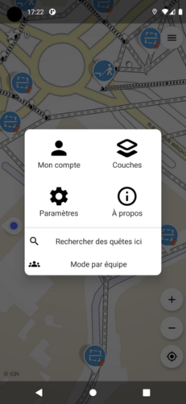

# Utilisation avancée de l'application mobile

## Charger les quêtes à l'endroit de la carte

La portion de la carte qui est hachurée représente les zones pour lesquelles
les quêtes n'ont pas été téléchargées. L'application télécharge automatiquement 
les quêtes autour de votre localisation, mais est parfois nécessaire de charger 
les quêtes ailleurs (par exemple avant de perdre le réseau), ou bien de 
recharger les quêtes si l'on pense que la donnée n'est plus à jour.

Pour cela, ouvrir le menu en haut à droite et cliquez sur "Rechercher des 
quêtes ici"

## Utiliser un fond d'imagerie aérienne

Dans le menu principal, cliquez sur "Paramètres" puis "Sélectionnez le type de 
fond".

## Modifier la liste des quêtes

Il est parfois utile de limiter le nombre de quêtes affichées, ou bien de 
modifier leur ordre d'apparition. Dans les paramètres, cliquez sur "Sélection 
et priorité des quêtes".

## Travailler avec les notes

TODO

### Créer une note

### Compléter une note