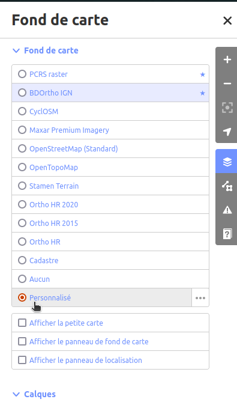
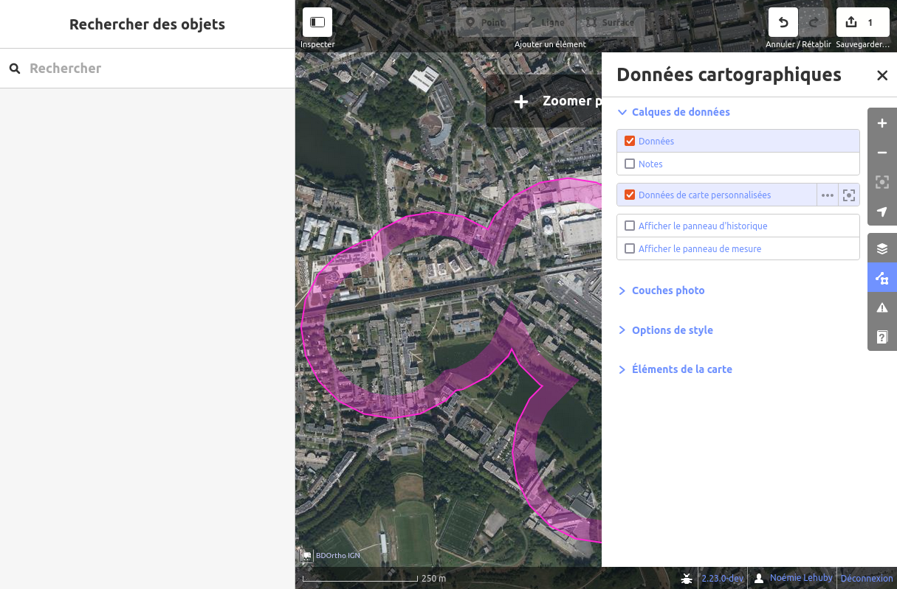
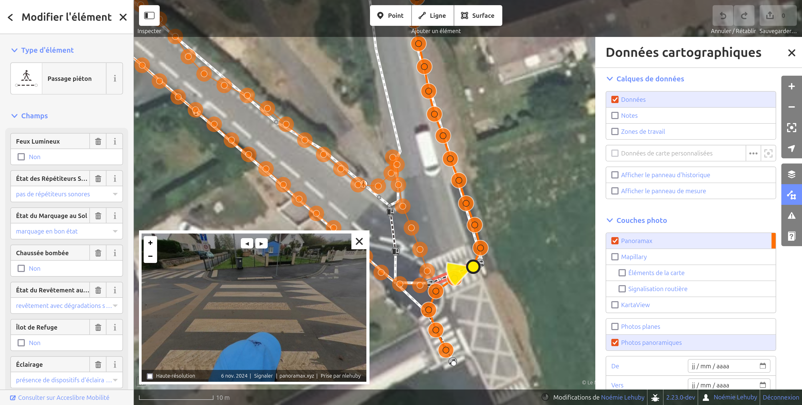
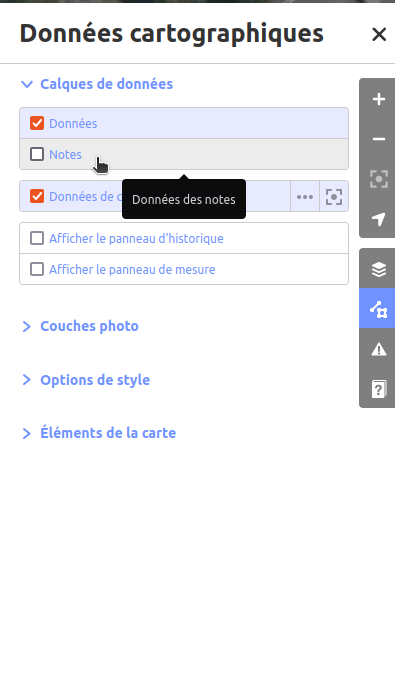
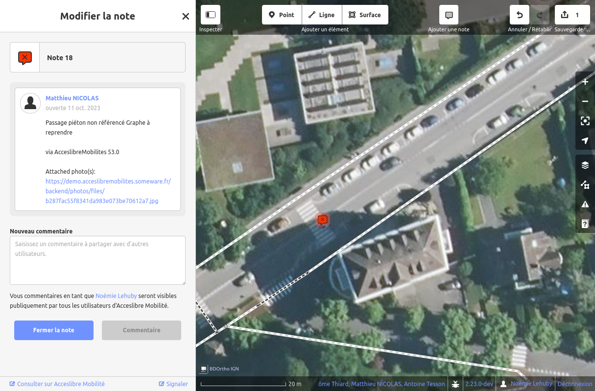

# Utilisations avancées de l'éditeur web

## Utiliser un fond de carte personnalisé

L'éditeur web propose par défaut plusieurs fonds de carte et vous permet de choisir parmi les meilleures imageries aériennes ou satellites sur votre territoire. D'autres fonds tels que le PCRS raster ou le cadastre sont également proposés s'ils sont en accès libre. Pour cela, utiliser "Paramètres du fond de carte" dans le menu à droite.

Si vous disposez d'un fond de carte plus précis qui n'est pas présent dans la liste, vous pouvez l'ajouter manuellement en toute autonomie, en sélectionnant "Personnalisé" dans le menu "Paramètres du fond de carte".

Vous pouvez alors renseigner l'adresse des tuiles.

## Afficher des données tierces

Si vous disposez d'un jeu de données utile pour votre projet et que vous souhaitez recopier ou comparer à votre graphe, il est possible de les afficher dans l'éditeur web.

Pour cela, glissez simplement le jeu de données dans la fenêtre de votre navigateur, ou cochez la case "Données de carte personnalisées" dans le menu "Données cartographiques" à droite.

Les données s'affichent alors en rose, et vous pouvez cliquer sur les éléments pour accéder à leurs attributs. Votre graphe n'est pas affecté : si vous souhaitez réutiliser certains éléments, vous devez les recopier.

Le format geojson est recommandé pour cet usage.

## Travailler avec des photos de rue

Plusieurs plateformes permettent d'explorer un territoire en parcourant des photos immersives de terrain. Ces photos peuvent constituer une ressource précieuse pour votre projet de cartographie. Vous pouvez donc les afficher en superposition de votre graphe piéton dans l'éditeur web.

Les plateformes suivantes sont supportées :

* [Panoramax](https://panoramax.fr) (instances IGN et OpenStreetMap France)
* [Mapillary](https://www.mapillary.com/?locale=fr_FR)
* [KartaView](https://kartaview.org/)

Pour afficher les photos de rues, cochez la plateforme correspondante dans le menu "Données cartographiques" à droite.

Les positions des photos disponibles s'affichent alors en vert ou orange. En cliquant sur un point, vous pouvez visualiser la photographie correspondante.

Des filtres supplémentaires sont également disponibles dans le menu "Données cartographiques" par exemple pour ne conserver que les photos panoramiques (à 360°) ou pour n'afficher que les photos prises sur une certaine plage de date.

!!! abstract "Conseil"

    Photo-documenter votre territoire avant de lancer votre projet de collecte de données d'accessibilité peut constituer une très bonne stratégie, notamment pour réaliser un graphe piéton de qualité. Notre équipe peut vous [proposer un accompagnement](../../contact.md) pour collecter des photos de rues sur votre territoire.

## Travailler avec les notes

Les notes peuvent être utilisées pour communiquer entre les différents 
utilisateurs d'Accèslibre Mobilités pour indiquer qu'un élément requiert une correction ou une attention particulière.

Il s'agit en effet d'un commentaire que vous pouvez laisser sur la carte et qui sera visible par les utilisateurs de l'éditeur web et de l'application mobile. Les notes peuvent également être commentées et agrémentées d'images.

Vous pouvez par exemple les utiliser pour signaler que vous n'êtes pas certain ou certaine de la présence d'une passage piéton ou d'un escalier. Les collecteurs terrain pourront alors vérifier cela et ajouter une photo sur votre note vous permettant de corriger le graphe en conséquence.

À l'inverse, les utilisateurs de l'application mobile pourront créer des notes pour indiquer qu'un passage piéton est manquant sur le graphe, et vous pourrez alors utiliser ce précieux retour pour l'ajouter dans l'éditeur web.

Pour afficher les notes dans l'éditeur, cochez "Notes" dans le menu "Données cartographiques" à droite.

Vous pouvez alors créer des nouvelles notes grâce au bouton "Ajouter une note" en haut.

Les notes existantes sont également représentées sur la carte sous la forme d'un pictogramme rouge. En cliquant sur une note, vous pouvez visualiser son contenu, ajouter votre propre commentaire, ou fermer la note pour indiquer que vous l'avez traitée.

Voir aussi :

* Le chapitre sur les notes dans l'aide intégrée de l'éditeur web ("Aide", dans le menu à droite)
* [la gestion des notes dans l'application mobile](../mobile/tweak.md#travailler-avec-les-notes)
