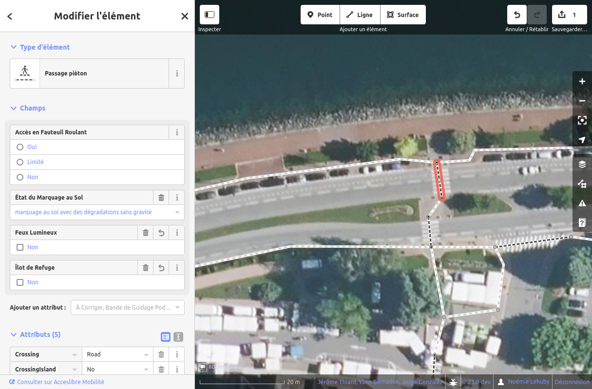

# L'éditeur web

L'éditeur web, aussi appelé Yukaidi, est un élément central du projet AccesLibre Mobilités : il permet de créer le [graphe piéton](graphe.md) (c'est-à-dire le réseau des trottoirs, passages piétons et autres cheminements) mais aussi de visualiser l'état de la collecte et le détail des attributs de chaque objets sur une carte.

## Utilisation

L'utilisation de l'éditeur web repose sur les principes suivants :

* Une imagerie aérienne ou satellite est affichée par défaut, et on peut se déplacer et zoomer sur cette carte.
* Les éléments du graphe sont affichés par dessus, et on peut cliquer pour les sélectionner, vérifier leurs attributs et les compléter
* Les outils de dessin sont affichés en haut : ils permettent de créer de nouveaux objets (cheminements, ERP, obstacles, etc)
* Enfin, un menu permet d'accéder à des options plus avancées pour personnaliser l'éditeur

Pour créer un nouvel objet, on procédera de la sorte :

* se positionner le plus finement sur la carte à l'endroit où on souhaite ajouter l'objet
* sélectionner la géométrie en cliquant sur le bouton correspondant dans la barre en haut
* tracer le plus précisément possible cet objet
* sélectionner le type d'objet en utilisant le menu ou la barre de recherche affichée
* ajouter les attributs connus

!!! info

    Ne pas oublier d'envoyer ses modifications de temps en temps afin de les sauvegarder, en cliquant sur le bouton en haut à droite.

## Trouver de l'aide

Bien que l'utilisation de l'éditeur web soit assez simple et intuitive, il est recommandé d'effectuer en entier le tutoriel qui s'affiche lors de la première utilisation : il permet en effet de se familiariser avec l'interface mais aussi de découvrir les types d'objets qu'il est possible de gérer dans AccesLibre Mobilités.

!!! info

    Si vous souhaitez refaire le tutoriel, vous pouvez cliquer à tout moment sur "Aide", puis commencer le guide.

    

Les modifications effectuées dans le tutoriel ne sont jamais sauvegardées et ne viendront pas créer de fausses données sur votre périmètre.

Une aide textuelle est également disponible en cliquant sur le bouton "Aide" du menu à droite. Elle détaille le fonctionnement de la navigation et de l'édition ainsi que quelques fonctionnalités avancées.
Vous pouvez également y accéder avec le raccourci clavier `H`.

